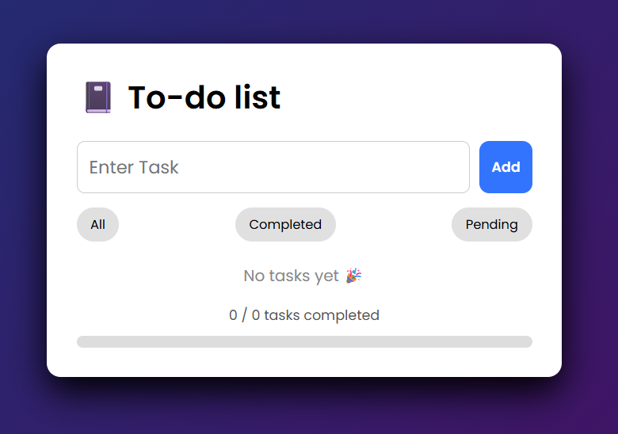
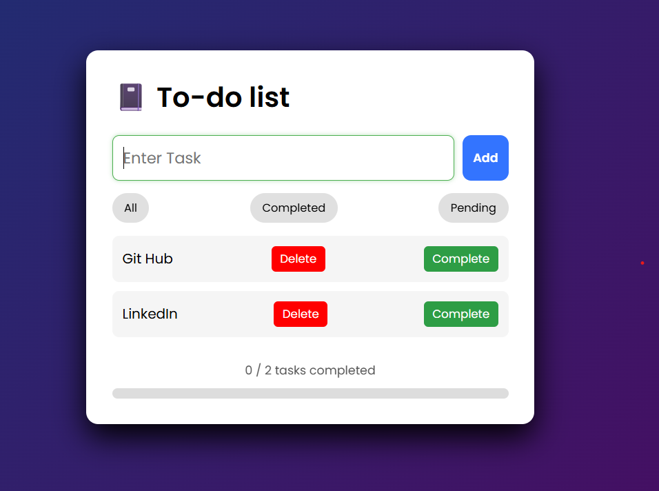
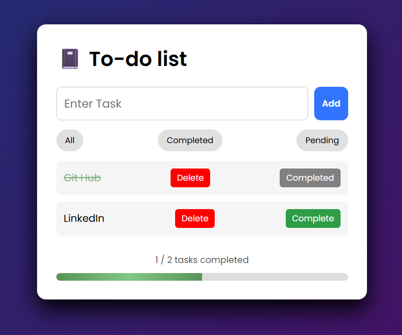

# 📝 To-Do List Web App
## By Harman Singh and Mehar Surati

A simple and interactive **task management web application** built with **HTML, CSS, and JavaScript**.  
Users can add tasks, mark them as completed, filter tasks, and track progress. Tasks are stored using **LocalStorage**, so they remain even after refreshing the page.

---

## 🚀 Features

- Add tasks using the **Add button or Enter key**
- Mark tasks as **Completed**
- Delete tasks
- Filter tasks (**All / Completed / Pending**)
- **Progress tracker** with progress bar
- Tasks saved in **LocalStorage**
- Smooth UI animations when adding tasks
- Clean and responsive interface

---

## 🛠 Technologies

- **HTML5**
- **CSS3** (Flexbox, transitions, animations)
- **JavaScript (ES6)**
- **LocalStorage API**

---

## ⚙️ How It Works

Tasks are stored in a JavaScript array and rendered dynamically on the page.

Example task object:

```javascript
{
  text: "Study JavaScript",
  completed: false
}
---
```
## 📸Screenshot
### Empty State


### Tasks Added


### Completed Tasks

